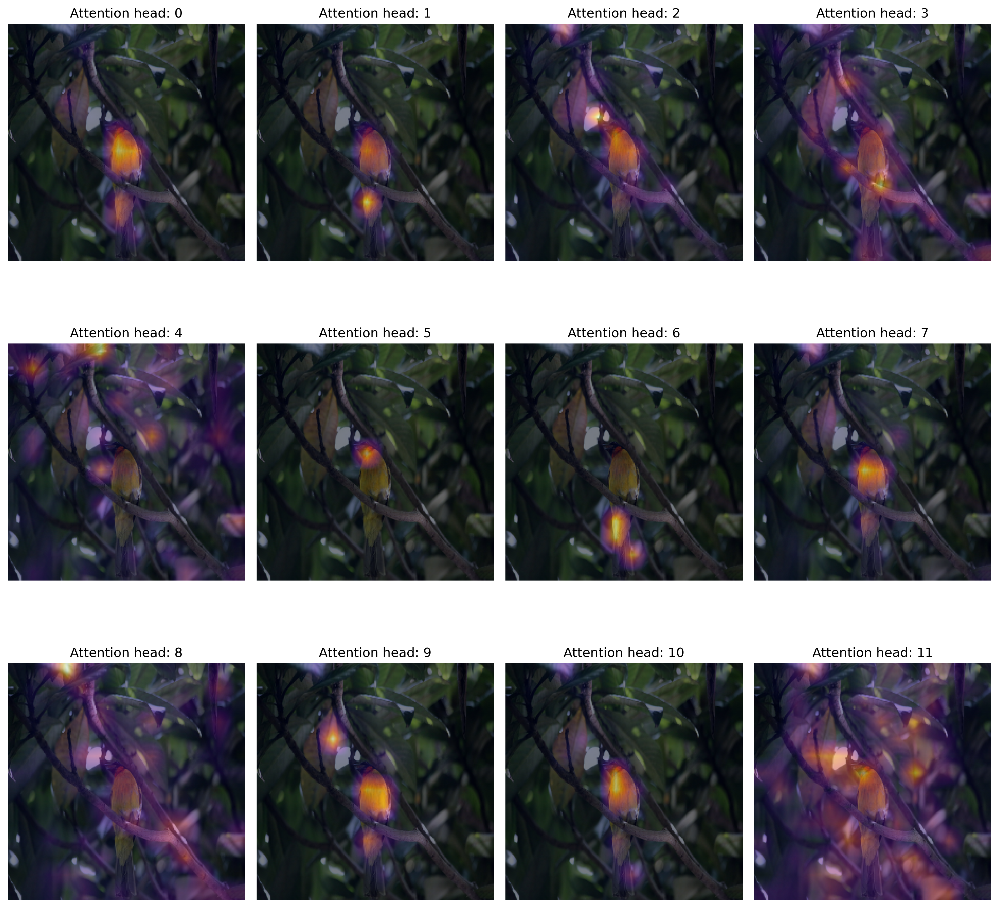

# Probing ViTs

_By [Aritra Roy Gosthipaty](https://github.com/ariG23498) and [Sayak Paul](https://github.com/sayakpaul) (equal contribution)_

In this repository, we provide tools to probe into the representations learned by different families of Vision Transformers (supervised pre-training with ImageNet-21k, ImageNet-1k, distillation, self-supervised pre-training):

* Original ViT [1] 
* DeiT [2]
* DINO [3]

We hope these tools will prove to be useful for the community. Please follow along with this post (coming soon) on keras.io for better navigation through the repository. 

## Self-attention visualization

| Original Image | Attention Maps | Attention Maps Overlayed |
| :--: | :--: | :--: |
|  |  |  |

https://user-images.githubusercontent.com/36856589/162609884-8e51156e-d461-421d-9f8a-4d4e48967bd6.mp4

<small><a href=https://www.pexels.com/video/a-computer-generated-walking-dinosaur-4096297/>Original Video Source</a></small>

https://user-images.githubusercontent.com/36856589/162609907-4e432dc4-a731-40f4-9a20-94e0c8f648bc.mp4

<small><a href=https://www.pexels.com/video/a-dog-running-in-a-grass-field-4166343/>Original Video Source</a></small>

## Supervised salient representations

In the [DINO](https://ai.facebook.com/blog/dino-paws-computer-vision-with-self-supervised-transformers-and-10x-more-efficient-training/) blog post, the authors show a video with the following caption:

> The original video is shown on the left. In the middle is a segmentation example generated by a supervised model, and on the right is one generated by DINO. 

A screenshot of the video is as follows:

 

We obtain the attention maps generated with the supervised pre-trained model and find that they are not that salient w.r.t the DINO model. We observe a similar behaviour in our experiments as well. The figure below shows the attention heatmaps extracted with
a ViT-B16 model pre-trained (supervised) using ImageNet-1k:

| Dinosaur | Dog | 
| :--: | :--: | 
|  |  | 

We used this [Colab Notebook](https://github.com/sayakpaul/probing-vits/blob/main/notebooks/vitb16-attention-maps-video.ipynb) to conduct this experiment.

## Hugging Face Spaces

You can now probe into the ViTs with your own input images.

| Attention Heat Maps | Attention Rollout |
| :--: | :--: |
|  |  |

## Visualizing mean attention distances

## Methods

**We don't propose any novel methods of probing the representations of neural networks. Instead we take the existing works and implement them in TensorFlow.**

* Mean attention distance [1, 4]
* Attention Rollout [5]
* Attention maps from individual attention heads [3]
* Generation of attention heatmaps from videos [3]

Another interesting repository that also visualizes ViTs in PyTorch: https://github.com/jacobgil/vit-explain.

## Notes

We first implemented the above-mentioned architectures in TensorFlow and then we populated the pre-trained parameters into them using the official codebases. In order to validate this, we evaluated the implementations on the ImageNet-1k validation set and ensured that the reported top-1 accuracies matched. 

We value the spirit of open-source. So, if you spot any bugs in the code or see a scope for improvement don't hesitate to open up an issue or contribute a PR. We'd very much appreciate it. 

## Navigating through the codebase

Our ViT implementations are in `vit`. We provide utility notebooks in `notebooks` which contains the following:

* [`dino-attention-maps-video.ipynb`](https://github.com/sayakpaul/probing-vits/blob/main/notebooks/dino-attention-maps-video.ipynb) shows how to generate attention heatmaps from a video.
* [`dino-attention-maps.ipynb`](https://github.com/sayakpaul/probing-vits/blob/main/notebooks/dino-attention-maps.ipynb) shows how to generate attention maps from individual attention heads from the final transformer block.
* [`load-dino-weights-vitb16.ipynb`](https://github.com/sayakpaul/probing-vits/blob/main/notebooks/load-dino-weights-vitb16.ipynb) shows how to populate the pre-trained DINO parameters into our implementation. 
* [`load-jax-weights-vitb16.ipynb`](https://github.com/sayakpaul/probing-vits/blob/main/notebooks/load-jax-weights-vitb16.ipynb) shows how to populate the pre-trained ViT parameters into our implementation. 
* [`mean-attention-distance-1k.ipynb`](https://github.com/sayakpaul/probing-vits/blob/main/notebooks/mean-attention-distance-1k.ipynb) shows how to plot mean attention distances of different transformer blocks of different ViTs computed over 1000 images.
* [`single-instance-probing.ipynb`](https://github.com/sayakpaul/probing-vits/blob/main/notebooks/single-instance-probing.ipynb) shows how to compute mean attention distance, attention-rollout map for a single prediction instance.

DeiT-related code has its separate repository: https://github.com/sayakpaul/deit-tf.

## Training and visualizing with small datasets

Coming soon!

## References

[1] An Image is Worth 16x16 Words: Transformers for Image Recognition at Scale:  [https://arxiv.org/abs/2010.11929](https://arxiv.org/abs/2010.11929)

[2] DeiT: https://arxiv.org/abs/2012.12877

[3] DINO: https://arxiv.org/abs/2104.14294

[4] Do Vision Transformers See Like Convolutional Neural Networks?:  [https://arxiv.org/abs/2108.08810](https://arxiv.org/abs/2108.08810)

[5] [Quantifying Attention Flow in Transformers](https://arxiv.org/abs/2005.00928)

## Acknowledgements

- [PyImageSearch](https://pyimagesearch.com)
- [Jarvislabs.ai](https://jarvislabs.ai/)
- [GDE Program](https://developers.google.com/programs/experts/)
